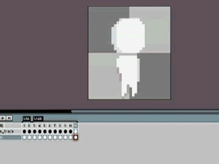
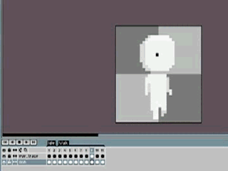
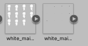
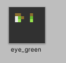
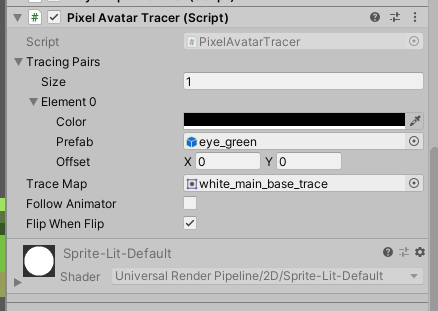
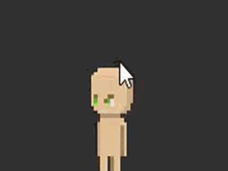

# Install

download the code and drag the folder into your project

**Note** that current version lacks stability and is still under development.

# Basic Idea

let sprite use a specified trace map to trace the position where other artwork or gameobject to be attached on.

# Usage

## Artwork Workflow
give an artwork like this:

(made by [**aseprite**](https://github.com/aseprite/aseprite) btw)

attach a tracing layer to present position of the eye

export the original artwork and tracing layer respectively

it should be like this:

## Usage in unity

then give an artwork which is going to be attached like this:

(it should be a prefab. Animator is supported but only wokr for integer parameters in current)

after finish setting for the little white man

drag the PixelAvatarTracer to the white man's gameobject ,and set the properties like this.

result in unity:

should work fine

# interface

Tracing Paris is a tuple 

**Color** refers to the color in the trace map

**Prefab** is the gameobject ot be attached

**Offset** is the offset of the attached gameobject offset from the center.

choose **Follow Animator** if you want the traced gameobject's animator synchronize with the avatar's animator  

choose **Flip When Flip** if you want Flip the traced gameobject when traced game object is fliped

